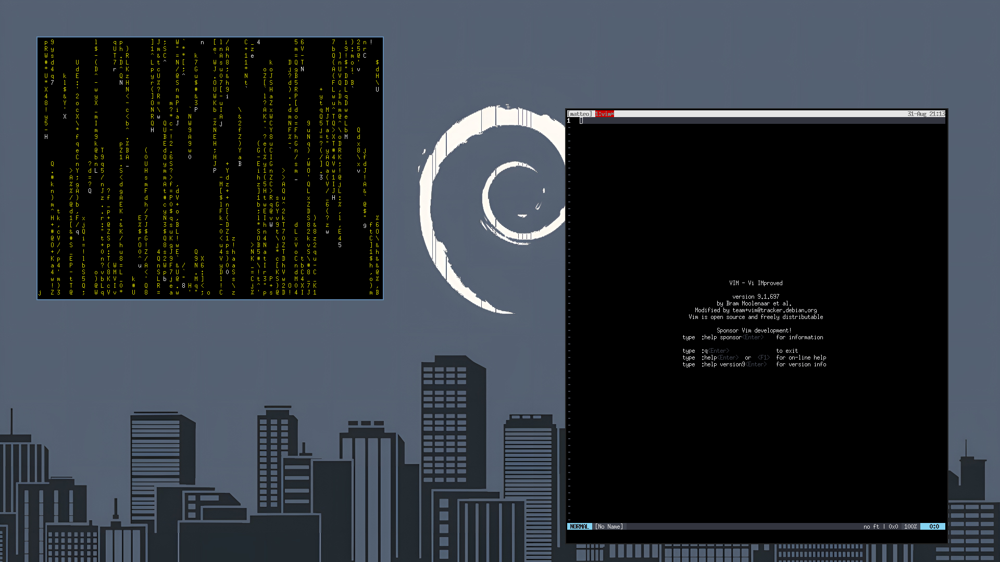

# FloeWM: minimal floating window manager for X11

FloeWM is one C file (`floe.c`) using Xlib directly, no config file, no external dependencies beyond Xlib itself. Windows float where their client (or the user) places them — there is no tiling layout to compute or maintain, which is what keeps the whole program small enough to read start to finish in a few minutes.




## How it works

Under X11, a window manager is not a special, privileged component of the display server: it's a normal client that asks for one extra permission. FloeWM opens a connection to the X server and selects `SubstructureRedirectMask` on the root window. From that point on, the server no longer carries out other clients' requests to map, move, resize, or restack their windows directly — it hands each request to FloeWM as an event instead, and FloeWM decides what to do with it. Only one client can hold this privilege at a time, which is exactly what "being the window manager" means; FloeWM detects and refuses to start if another one already owns it.

The rest of the program is a single event loop (`main()`), reacting to whatever the server reports:

| Event                                            | What FloeWM does                                                                                        |
|--------------------------------------------------|---------------------------------------------------------------------------------------------------------|
| `MapRequest`                                     | A client wants to appear. FloeWM gives it a border and maps it as-is — floating means no repositioning. |
| `ConfigureRequest`                               | A client wants to move/resize/restack itself. FloeWM grants the request verbatim.                       |
| `EnterNotify`                                    | The pointer entered a window. FloeWM focuses it (focus-follows-mouse).                                  |
| `KeyPress`                                       | One of the three grabbed shortcuts (spawn terminal / close / quit).                                     |
| `ButtonPress` / `MotionNotify` / `ButtonRelease` | Alt+drag move/resize, driven by the pointer grab started on press.                                      |

There is no hidden state machine and no polling: if nothing happens on the X connection, FloeWM is asleep inside `XNextEvent()`. The only piece of state carried between events is which window is focused and, during a drag, which window/button/geometry started it.

Two X11 mechanics worth knowing about before reading the code:

- **Passive grabs** (`XGrabKey` / `XGrabButton` in `grab()`) are how FloeWM gets global keyboard/mouse shortcuts: it tells the server up front which key/button combinations to redirect to it instead of delivering them straight to the window under the pointer.
- **`WM_DELETE_WINDOW`** (used in `close_window()`) is the ICCCM convention for asking a client to close itself gracefully (so it can prompt for unsaved changes, etc.) instead of severing its X connection outright with `XKillClient`.


## Build

Requires a C compiler and the Xlib headers (e.g. `libx11-dev` / `libX11-devel`).

```
make
```

This produces a `floe` binary in the project directory.

Other targets:

```
make clean      # remove the built binary
make install    # install the binary and the xsessions entry, see Autostart below
make uninstall  # remove everything make install put in place
```

`install`/`uninstall` accept `DESTDIR`, `PREFIX` (default `/usr/local`, where the binary goes) and `XSESSIONSDIR` (default `/usr/share/xsessions`, where the session entry described in Autostart goes) to override the destination, e.g. `make install PREFIX=$HOME/.local`.


## Configure

There is no config file and no parser — FloeWM follows dwm's approach of config-as-source. All tunables live in the `config` block at the top of `floe.c`:

| Define         | Meaning                                         |
|----------------|-------------------------------------------------|
| `MOD`          | Modifier key for every binding (default: Alt)   |
| `BORDER_WIDTH` | Window border thickness in pixels               |
| `COL_FOCUS`    | Border color of the focused window (`0xRRGGBB`) |
| `COL_NORMAL`   | Border color of every other window              |
| `termcmd`      | argv used to spawn a terminal                   |

Edit the value you want, then `make` again — there's nothing to reload, just restart FloeWM.


## Use

Run `floe` in place of your usual window manager, or try it inside a nested X server first so it can't disturb your real session:

```
Xephyr -br -ac -screen 1280x800 :1 &
DISPLAY=:1 ./floe &
DISPLAY=:1 xterm &
```

See Autostart below for making FloeWM your actual login session.


### Keybindings

| Binding                 | Action                              |
|-------------------------|-------------------------------------|
| `Alt+Shift+Return`      | spawn a terminal                    |
| `Alt+Shift+c`           | close the focused window            |
| `Alt+Shift+q`           | quit FloeWM                         |
| `Alt` + drag (button 1) | move the window under the pointer   |
| `Alt` + drag (button 3) | resize the window under the pointer |

Focus follows the mouse: moving the pointer into a window focuses it.


## Autostart

How to make FloeWM start automatically depends on how you log in.


### With a display manager (LightDM, GDM, SDDM, …)

`make install` installs `floe.desktop` into `/usr/share/xsessions/` alongside the binary, so most display managers pick it up automatically:

```
sudo make install
```

"FloeWM" then shows up as a session choice on the login screen (usually a small menu next to the password field) — select it before logging in.


### With `startx`/`xinit` (no display manager)

Add FloeWM as the last line of `~/.xinitrc`. It must be run with `exec`, not backgrounded with `&`, so the X session ends when FloeWM quits rather than immediately:

```
exec floe
```

Then start the session as usual:

```
startx
```


### Inside an existing desktop session

FloeWM doesn't speak EWMH yet (see Known limitations / TODO below), so panels and other components of a full desktop environment that expect a compliant window manager may not fully cooperate with it if you swap it in for their own WM (e.g. in place of `xfwm4` under XFCE). Until that lands, the two options above — running FloeWM as its own standalone session — are the ones actually worth using.


## Troubleshooting

### Shortcuts don't work / I can't spawn a terminal or quit

The near-certain cause is **NumLock** (or CapsLock/ScrollLock) being on at login: X key grabs match an exact modifier state, so a lock key being active changes that state and every Alt+Shift shortcut silently stops firing. FloeWM already grabs each binding across every combination of lock modifiers (see `update_numlockmask()`/`grab()` in `floe.c`), so a build from source after that fix was added should not have this problem; if it still does, double check you rebuilt and reinstalled (`make && sudo make install`) after pulling the latest source.

### I'm stuck in a FloeWM session with no way out

Switch to a text console with `Ctrl+Alt+F2` (try `F1` through `F6` if that doesn't work) and log in there, then end the FloeWM process from the shell:

```
pkill -u "$USER" floe
```

The X session waiting on FloeWM exits along with it, and the display manager should return to the login screen. Switch back to the graphical console (often `Ctrl+Alt+F7` or `F1`) if it doesn't happen automatically.


## Known limitations (left out on purpose)

FloeWM optimizes for a small, readable core over feature completeness. Left out deliberately, in rough order of how likely they are to bite:

- **Assumes a TrueColor default visual.** Border colors are set as raw `0xRRGGBB` pixel values, which only works directly on a TrueColor visual. Fine on virtually every modern setup, but not portable to a palette-based visual.
- **No EWMH (`_NET_*`) support.** FloeWM doesn't announce itself or a window list via the EWMH properties, so external panels, task bars, and tools like `wmctrl` won't see or control it.


## TODO

- [ ] Basic EWMH (`_NET_*`) support, so panels, task bars, and `wmctrl` can see and interact with FloeWM.
- [ ] Recognize windows that shouldn't be treated like ordinary top-level windows — dialogs/popups via `_NET_WM_WINDOW_TYPE`, `WM_NORMAL_HINTS` size hints, and override-redirect windows (menus, tooltips) that must be left untouched.
- [ ] Refactor the core around a small set of internal commands (focus, close, spawn, move, resize, quit) exposed over a socket, bspwm-style, so the WM itself stays a mute core driven by an external client.
- [ ] Once the socket/command layer exists, a small Guile client to script configuration and behavior from outside the WM, without embedding an interpreter into the core.
